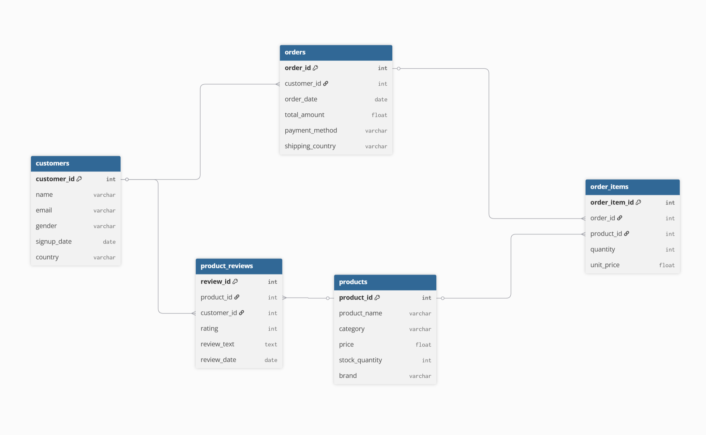

# Synthetic E-Commerce Relational Dataset Generator

This dataset is synthetically generated fake data designed to simulate a realistic e-commerce environment.

---

## Purpose
To provide large-scale relational datasets for practicing database operations, analytics, and testing tools like DuckDB, Pandas, and SQL engines.
Ideal for benchmarking, educational projects, and data engineering experiments.

---

## Entity Relationship Diagram (ERD) - Tables Overview

### 1. Customers
- **customer_id** (`int`): Unique identifier for each customer  
- **name** (`string`): Customer full name  
- **email** (`string`): Customer email address  
- **gender** (`string`): Customer gender ('Male', 'Female', 'Other')  
- **signup_date** (`date`): Date customer signed up  
- **country** (`string`): Customer country of residence  

### 2. Products
- **product_id** (`int`): Unique identifier for each product  
- **product_name** (`string`): Name of the product  
- **category** (`string`): Product category (e.g., Electronics, Books)  
- **price** (`float`): Price per unit  
- **stock_quantity** (`int`): Available stock count  
- **brand** (`string`): Product brand name  

### 3. Orders
- **order_id** (`int`): Unique identifier for each order  
- **customer_id** (`int`): ID of the customer who placed the order (foreign key to Customers)  
- **order_date** (`date`): Date when order was placed  
- **total_amount** (`float`): Total amount for the order  
- **payment_method** (`string`): Payment method used (Credit Card, PayPal, etc.)  
- **shipping_country** (`string`): Country where the order is shipped  

### 4. Order Items
- **order_item_id** (`int`): Unique identifier for each order item  
- **order_id** (`int`): ID of the order this item belongs to (foreign key to Orders)  
- **product_id** (`int`): ID of the product ordered (foreign key to Products)  
- **quantity** (`int`): Number of units ordered  
- **unit_price** (`float`): Price per unit at order time  

### 5. Product Reviews
- **review_id** (`int`): Unique identifier for each review  
- **product_id** (`int`): ID of the reviewed product (foreign key to Products)  
- **customer_id** (`int`): ID of the customer who wrote the review (foreign key to Customers)  
- **rating** (`int`): Rating score (1 to 5)  
- **review_text** (`string`): Text content of the review  
- **review_date** (`date`): Date the review was written  

### Visual EDR



---

## Notes

- All data is randomly generated using Python’s Faker library, so it does **not** reflect any real individuals or companies.
- The data is provided in both **CSV** and **Parquet** formats.
- The generator script is available in the accompanying GitHub repository for reproducibility and customization.

---

## Features

- Generates **Customers**, **Products**, **Orders**, **Order Items**, and **Product Reviews**.
- Saves data in **CSV** and **Parquet** formats.
- **Auto-installs** required Python packages if missing.
- Adjustable dataset sizes via CLI arguments.
- `--quick` flag for instant small-sample generation.

---

## Installation

Clone the repository:

```bash
git clone https://github.com/NaelAqel/db_gen.git
cd db_gen
```
OR if you want the script file only run this
```bash
!wget https://raw.githubusercontent.com/NaelAqel/db_gen/refs/heads/main/db_gen.py
```

Requires **Python 3.8+**.  
No need to manually install dependencies — the script will install them automatically.

---

## Usage

### 1. Default mode (large datasets for stress testing)
```bash
python db_gen.py
```
**Default sizes:**
| Dataset         | Rows       |
|-----------------|-----------:|
| Customers       | 1,000,000  |
| Products        | 10,000     |
| Orders          | 4,000,000  |
| Order Items     | 10,000,000 |
| Reviews         | 2,000,000  |

---

### 2. Quick mode (small datasets for instant testing)
```bash
python dataset_generator.py --quick
```
**Quick mode sizes:**
| Dataset         | Rows  |
|-----------------|------:|
| Customers       | 100   |
| Products        | 10    |
| Orders          | 200   |
| Order Items     | 500   |
| Reviews         | 100   |

---

### 3. Custom mode (set your own sizes and output folder)
```bash
python dataset_generator.py \
    --customers 5000 \
    --products 300 \
    --orders 2000 \
    --order-items 8000 \
    --reviews 1500 \
    --path ./data
```

---

## Output
The script saves two folders inside the specified output path:

```
csv/       # CSV files
parquet/   # Parquet files
```

---

## Dependencies
Installed automatically if missing:
- `Faker` — generate realistic fake data
- `pandas` — data handling
- `numpy` — numeric operations
- `pyarrow` — Parquet file support

---

## License
MIT License
